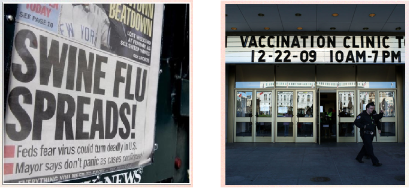
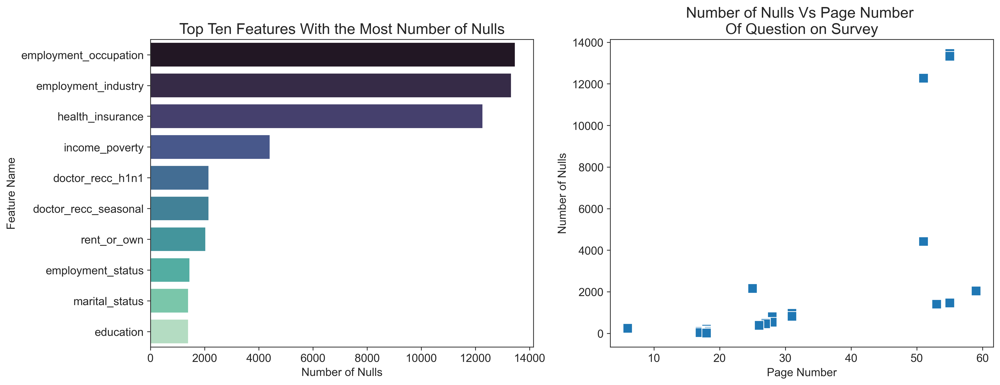
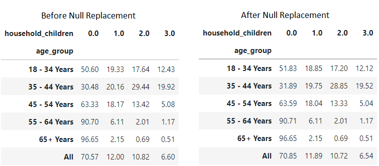
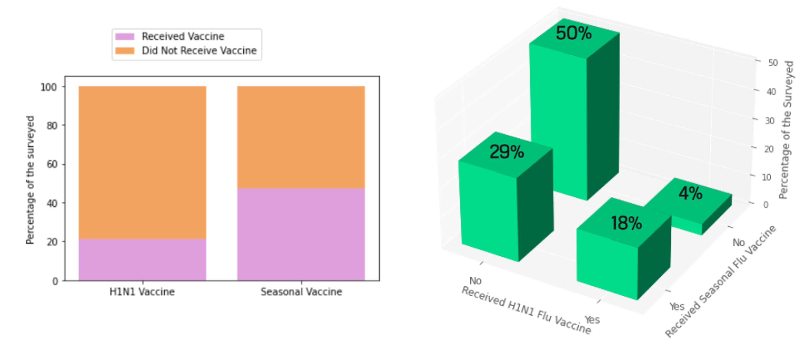
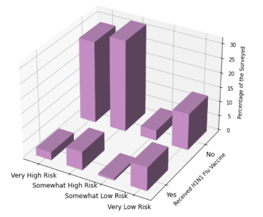
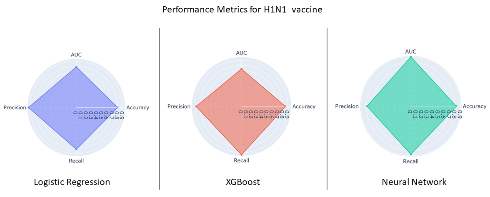
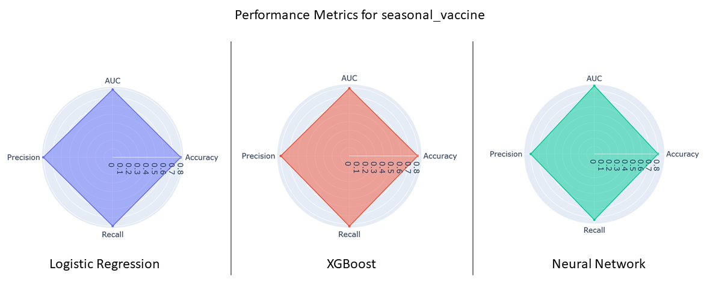
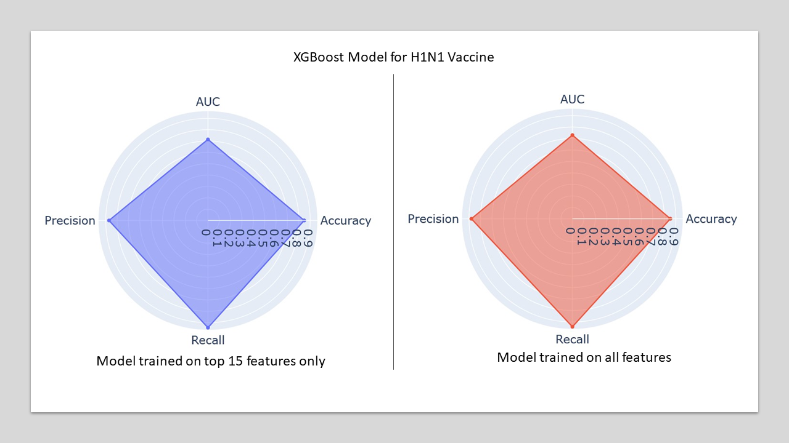
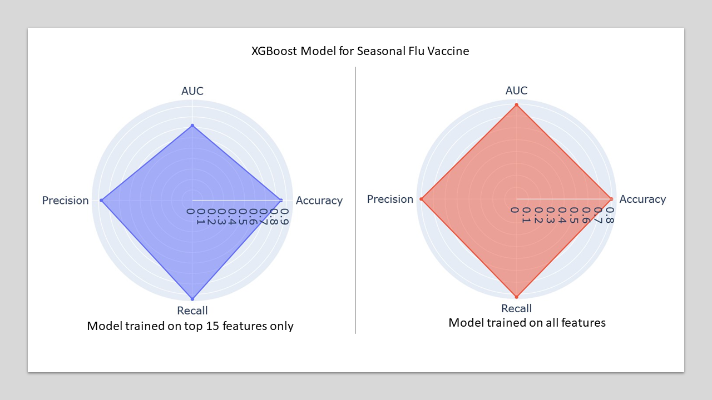

# **Predicting H1N1 and Seasonal Flu Vaccination**
#### **Collaborators**: 
[**Lavanya Acharya**](https://github.com/LAcharya) | [**Katrin Ayrapetov**](https://github.com/Kaayrapetov) | [**Sean Li**](https://github.com/syxli)  

### Contents:
* Introduction
* Data
* Models and Metrics
* Methodology
* Results
* Conclusions and Recommendations
* Tables

### **Introduction**
In 2009, a novel strain of influenza virus, commonly referred to as “swine flu”, spread first across the United States and quickly around the world causing a pandemic. From April 2009 to April 2010, the CDC estimates that there were 60.8 million cases, 274,304 hospitalizations, and 12,469 deaths in the United States alone. A vaccine for the H1N1 flu virus became publicly available in October 2009. 

--------------------------  

###### **Figure 1.** *A view of a newspaper headline near Times Square in New York, New York, USA, on 27 April 2009. Photo by EPA/BGNES (Left). An H1N1 flu vaccination clinic held in San Francisco in December 2009, Justin Sullivan/Getty Images (Right)*

--------------------------

From August 2009 to May 2010, one or more doses of the *seasonal flu vaccine* were administered to 31.6 million children and 91.6 million adults. During the same time period, one or more doses of the *H1N1 vaccine* were administered to 29.1 million children and 80.8 million adults. 

#### **National H1N1 Flu Survey**

In 2009, the US National Center for Health Statistics conducted [National H1N1 Flu Survey](https://www.cdc.gov/nchs/nis/data_files_h1n1.htm) over phone. The phone survey asked respondents whether they had received the H1N1 and seasonal flu vaccines, in conjunction with questions about themselves. The questions covered the respondents’ social, economic, and demographic background, opinions on vaccine effectiveness and risks, and behaviors towards mitigating transmission. The [survey](https://ftp.cdc.gov/pub/Health_Statistics/NCHS/Dataset_Documentation/NIS/nhfs/nhfspuf_QUEX.PDF) is sixty pages long. 

Below is a description of the survey from the [CDC page for National Immunization Surveys](https://ftp.cdc.gov/pub/Health_Statistics/NCHS/Datasets/nis/nhfs/nhfspuf_readme.txt):

--------------------------

**"** *The National 2009 H1N1 Flu Survey (NHFS) was sponsored by the 
National Center for Immunization and Respiratory Diseases 
(NCIRD) and conducted jointly by NCIRD and the National 
Center for Health Statistics (NCHS), Centers for Disease 
Control and Prevention (CDC). The NHFS was a list-assisted 
random-digit-dialing telephone survey of households, designed
to monitor influenza immunization coverage in the 2009-10 season.*

*The target population for the NHFS was all persons 6 months or
older living in the United States at the time of the 
interview. Data from the NHFS were used to produce timely estimates 
of vaccination coverage rates for both the monovalent pH1N1 and
trivalent seasonal influenza vaccines.* **"**

--------------------------

### **Data**
Data was obtained from [DrivenData](https://www.drivendata.org/about/), a website that hosts data science competitions and crowdsources social challenges from across the world. This particular dataset was from the [Flu Shot Learning](https://www.drivendata.org/competitions/66/flu-shot-learning/) competition. 

The data consists of 36 features consisting of binary, ordinal and categorical responses. The [data dictionary from DrivenData](https://www.drivendata.org/competitions/66/flu-shot-learning/page/211/) is provided in table 1. 

### **Models and Metrics**

Three Models were tested for their ability to predict whether respondents were vaccinated or unvaccinated: 
* Logistic Regression
* Neural Network
* XGBoost

The models were compared on four metrics: 
* Recall
* Precision
* Accuracy
* ROC_AUC

Recall score was chosen to be the most important metric to compare models. This was because the goal was to minimize the number of respondents falsely classified as vaccinated, in order to capture as many unvaccinated respondents as possible. 

### **Methodology**

We first performed exploratory data analysis and null imputation on our dataset to get a clean dataset that can be fed into our models. This dataset was then used to train a number of models with the following goals in mind:

1. to find the best model to capture all observations that are unvaccinated based on predictor features. 
2. to use the best model to find the most predictive features, and confirm the predictive nature of these features by training our best model on this subset and comparing metrics with the initial model trained on the full set of feature. 
3. to provide a recommendation for areas of focus for the CDC to shorten, or rearrange the survey so that a cleaner dataset can be obtained with minimal missing values. 

### **Results**

#### Exploratory Data Analysis and Cleaning

**Exploring Nulls**: The survey was done over phone and respondents were allowed to refuse to respond to any question asked. These represented a large portion of the nulls in the data. To better understand the distribution of nulls, we first examine which features had the most missing data (Figure 2 (Left)) and discovered that some features were missing upto half of their data. Next, we compared the number of nulls to the page number on the survey questions script that the question appeared on. We found that as the survey progressed, the number of null values increased (Figure 2 (Right)).    

###### **Figure 2.** ***Left**: A barchart of the top 10 of 36 features that had the most number of nulls. **Right**: A scatterplot of the number of null values in a given feature column versus the page number that the corresponding question appears on in the survey. There is a clear increase in the number of nulls as the survey progresses.*

**Imputing Nulls**: Nulls were replaced according to the following procedure:
We looked closely at the distribution of values and replaced the missing observations with either the median, or proportionally with respect to the distribution of the feature across different age groups of respondants. For instance, as seen in Figure 3., the missing values in the feature `household_children` were replaced with values that maintained the same proportion of responses across the different age groups. 

###### Figure 3. *Tables showing the distribution of values across different age groups before (**Left**) and after (**Right**) null replacement for the feature `household_children`*

A complete summary of null replacements is provided in Table 2. 

**Exploratory Data Analysis**

Our target variables were `H1N1_vaccine` and `seasonal_vaccine`, both of which had binary values of 1 for vaccinated and 0 for unvaccinated. Figure 4 illustrates the distribution of values for the two target variables. We found that which the two classes for `seasonal_vaccine` were balanced, there was a large inbalance in the number of observations for the vaccinated and unvaccinated groups for `H1N1_vaccine`. 

Additionally, looking at the interaction between the two target variables, we found that receiving the H1N1 vaccine and receiving the Seasonal flu vaccine were statistically dependent events. In fact, while the probability that a respondent received the seasonal vaccine was 47%, the probability that a respondent received the seasonal vaccine given they received the H1N1 vaccine was 82%. 

###### Figure 4.***Left**. Number of positive and negative classes for each target variable. H1N1 Vaccine: 21% vaccinated, and 79% unvaccinated; Seasonal Vaccine: 47% vaccinated, and 53% unvaccinated. **Right**  Bar graph showing that the two target variables were not independent of eachother.*

One of the more interesting observations from the data analysis we performed, was that there was a statistically significant dependency between respondent's perceived risk of the H1N1 vaccine and whether they chose to receive the H1N1 vaccine (Figure 5).  

###### Figure 5.*Bargraph showing the relationship between perceived risk of vaccine and vaccination status. The two tallest bars represent  the people who did not receive the vaccine and perceived it as very high or somewhat high risk. We can see that those people are in the majority.*

#### Approach and Initial Models

Since the dataset has two labels, it requires a multi-label classification approach. This means that each observation can have multiple labels assigned to it. In our case it would be yes/no to `H1N1_vaccine` and yes/no to `seasonal_vaccine`.There are many methods to approaching multilabel problems, and we chose to approach it as two separate binary classification problems, each with its own model. Therefore, we converted the data set into two single class binary datasets and fit a binary classification model to each data set.

**Preliminary Models**

As a first pass, we used a gridsearch, and all features to see how a basic model would perform. The gridsearch was set to optimize for accuracy. Tests were run for both seasonal flu and H1N1, using accuracy and AUC as metrics on logistic regression, k-NN, multinomial Naive Bayes, and random forest classifiers for a total of 16 tests. While k-NN and random forest classifiers were severely overfit, logistic regression and multinomoal Naive Bayes prefromed comparably. Scores for logistic regression are shown below: 

Score | seasonal_vaccine | H1N1_vaccine
------|:------------------:|:-------------:
Accuracy| 0.779|0.848|
AUC | 0.854 |0.856|

Next, knowing that H1N1 and seasonal flu vaccination were dependent on each other, we tried using seasonal flu as a predictor for H1N1 vaccination. While using the given target column for seasonal flu vaccine yielded marginally better modele for H1N1 vaccination, using a predicted value of seasonal flu vaccination as a predictor did not improve performance. Values for AUROC score comparing the preliminary model and models using the *known* `seasonal_vaccine` classes are shown below: 

Model | Preliminary Model | Using `seasonal_vaccine` as predictor|
------|:------------------:|:------------------------------:|
Logistic Regression| 0.855 | 0.884|
*k*-NN | 0.798 |0.820|
mNB|0.789|0.803|
Random Forest|0.854|0.886

**Final Models : revisiting metrics**

For our final models, we chose Logistic Regression, XGBoost and Neural Networks. 

To improve our models, we made the following changes: 
1. Since we were more interested in the people who *did not get the vaccine*, we made them our positive class. That is, we changed the classes for both target variables so that `1` represented the *unvaccinated* group, and `0` represented the *vaccinated* group. 
2. Since we wanted to correctly classify as many unvaccinated respondents as possible, we changed our optimizing metric from AUROC (area under the ROC) and accuracy to recall and precision. For all our models, we recorded the following metrics:

Metric | Interpretation|
-------|---------------|
Accuracy| The percentage of respondents classified correctly
AUROC| Measure of overall classification performance
Recall| The percentage of respondents who did not receive the vaccine who were classified correctly. 
Precision| The percentage of respondents who were classified unvaccinated who who were, in fact, unvaccinated. 

**Final Models : Feature Engineering and balancing classes**

With the XGBoost models, we also tried feature engineering and created some interaction features to feed into our models. The feature engineering performed is described in Table 3. Additionally, we compared two methods of balancing classes: using a random oversampler and SMOTE. 

We then ran different combinations of XGBoost models: with our without feature engineering and class balancing. A summary of results is presented below: 

Optimized for | Features Used | Accuracy | Precision | Recall | Roc_Auc
--------------------|---------------|----------|-----------|--------|--------
roc_auc    |All features, target classes switched (unvacc = 1)| 0.855| 0.878 |0.948|0.730
roc_auc| All features + seasonal flu, target classes switched| 0.871|0.894|0.949|0.766 
Recall| All features, target classes switched|0.847|0.854|0.971|0.679
Recall|All features + engineered features, target classes switched|0.000|0.858|0.966|0.688|
Recall|Same as above + RandomOverSampler|0.810|0.930|0.821|0.796
Recall| Same as above but SMOTE | 0.000| 0.864| 0.955|0.701
Recall| Same as above, but gridsearched specifically with SMOTE balanced data|0.951|0.899|0.939|0.732

Feature engineering and balancing classes did not improve the XGBoost model significantly. Therefore, we compared our three final model types: Logistic Regression, XGBoost and Neural Networks only on the cleaned features and no class balancing.  

**Final Models : Results**

Below is a comparison of our models based on the recorded metrics

***H1N1 Vaccine***

Model | Accuracy | AUROC| Precision | Recall
---|---|---|---|---|
Logistic Regression| 0.803| 0.789 | 0.928 |0.813|
XGBoost| 0.852|0.730|0.879|0.942|
Neural Network|0.823|0.897|0.790|0.873|

###### Figure 6.*Radar charts comparing performance metrics for predicting H1N1 vaccination.*

***Seasonal flu Vaccine***

Model | Accuracy | AUROC| Precision | Recall
---|---|---|---|---|
Logistic Regression| 0.789| 0.788 | 0.804 |0.799|
XGBoost| 0.797|0.794|0.800|0.825|
Neural Network|0.800|0.864|0.800|0.834|

###### Figure 7.*Radar charts comparing performance metrics for predicting seasonal flu vaccination.*

#### Most Predictive Features

Our second goal was to determine which questions were most useful in predicting if a respondent was unvaccinated. In order to do this, we determined the top 15 most important features using coefficients from Logistic Regression, and feature importances from XGBoost for both H1N1 and seasonal vaccine. Table 4 shows the complete list of top 15 features for seasonal flu and H1N1 vaccine.

For H1N1_vaccine, we compared model performance when using either of these feature sets. Since this dataset has imbalanced classes we also compared using the top 15 features as is, or in combination with feature engineering and balancing classes. Figure 8 shows a comparison of performance metrics when using the full feature set versus using only the top 15 features. Below is the summary of results: 

Features|Accuracy|Precision|Recall|AUC|
-----|--------|---------|------|---|
Logistic Regression feat.engg + SMOTE|0.817|0.899|0.865|0.753|
Logistic Regression feat as is + SMOTE|0.824|0.901|0.873|0.759|
Logistic Regression feat as is|0.851|0.876|0.944|0.725|
XGBoost feat.engg + SMOTE|0.839|0.886|0.913|0.740|
XGBoost feat as is + SMOTE|0.839|0.886|0.913|0.739|
XGBoost feat. as is|0.847|0.871|0.945|0.714|

###### Figure 8.*Radar charts comparing performance metrics for predicting H1N1 vaccination using either only the top 15 features or the full feature set.*

Our best model was an XGBoost trained on the 15 most important features from an XGBoost model used without any feature engineering or balancing of classes.

For the seasonal flu vaccine, we used the top 15 features from an XGBoost model and trained an XGBoost model on this subset of features. Figure 9 shows a comparison of performance metrics when using the full feature set versus using only the top 15 features. Below are the results: 

Metric | With all features | With top 15 features
-------|-------------------|--------------------
Accuracy|0.797| 0.849
Precision|0.800| 0.873
Recall| 0.825 | 0.956
Roc_Auc| 0.794| 0.717

###### Figure 9.*Radar charts comparing performance metrics for predicting seasonal flu vaccination using either only the top 15 features or the full feature set.*

Given the performance of our models on the smaller subset of features we were able to conclude that these features are indeed predictive of whether a person is unvaccinated. 

### **Conclusions and Recommendations**

A better understanding of how behevioral, socioeconomic and demographic characteristics are associated with personal vaccination patterns can provide guidance for future public health efforts.

We first aimed to predict which respondents did not receive the vaccine. To do this, we chose to optimize our models for recall score, and compared multiple optimized models and were able to make predictictions with a recall of 0.94 for H1N1, and 0.83 for seasonal flu.

Our second aim was to identify the features in the dataset that were most predictive of whether a person did not get the vaccine. Using 15 of 35 features, our models predicted whether or a person was unvaccinated with a recall of 0.94 for both H1N1 and seasonal flu vaccines. This strongly indicates that the features we selected were indeed predictive of vaccination outcome. 

Fnally, we aimed to recommend areas of focus to shorten the survey. Our models identified the most predictive features as: 

1. availability of health insurance, 
2. perception of the vaccine (effectiveness, risks), 
3. knowledge of H1N1, 
4. kind of dwelling, 
5. doctor’s recommendation, 
6. employment, 
7. marital status, 
8. Behaviors,
9. level of education, 
10. overall health 
11. age

### **Tables**
---------------------------------------

##### Table 1. Data Dictionary

Variable | Description | Values|
---------|-------------|-------|
h1n1_concern | Level of concern about the H1N1 flu.|0 = Not at all concerned; 1 = Not very concerned; 2 = Somewhat concerned; 3 = Very concerned.
h1n1_knowledge | Level of knowledge about H1N1 flu.|0 = No knowledge; 1 = A little knowledge; 2 = A lot of knowledge.
behavioral_antiviral_meds | Has taken antiviral medications. | (binary)
behavioral_avoidance | Has avoided close contact with others with flu-like symptoms. | 0 = No; 1 = Yes.
behavioral_face_mask | Has bought a face mask. | 0 = No; 1 = Yes.
behavioral_wash_hands | Has frequently washed hands or used hand sanitizer. |(0 = No; 1 = Yes.
behavioral_large_gatherings | Has reduced time at large gatherings. | 0 = No; 1 = Yes.
behavioral_outside_home | Has reduced contact with people outside of own household. | 0 = No; 1 = Yes.
behavioral_touch_face | Has avoided touching eyes, nose, or mouth. | 0 = No; 1 = Yes.
doctor_recc_h1n1 | H1N1 flu vaccine was recommended by doctor. | 0 = No; 1 = Yes.
doctor_recc_seasonal | Seasonal flu vaccine was recommended by doctor. | 0 = No; 1 = Yes.
chronic_med_condition | Has any of the following chronic medical conditions: asthma or an other lung condition, diabetes, a heart condition, a kidney condition, sickle cell anemia or other anemia, a neurological or neuromuscular condition, a liver condition, or a weakened immune system caused by a chronic illness or by medicines taken for a chronic illness. | 0 = No; 1 = Yes.
child_under_6_months | Has regular close contact with a child under the age of six months. | 0 = No; 1 = Yes.
health_worker | Is a healthcare worker. | 0 = No; 1 = Yes.
health_insurance | Has health insurance. | 0 = No; 1 = Yes.
opinion_h1n1_vacc_effective | Respondent's opinion about H1N1 vaccine effectiveness. | 1 = Not at all effective; 2 = Not very effective; 3 = Don't know; 4 = Somewhat effective; 5 = Very effective.
opinion_h1n1_risk | Respondent's opinion about risk of getting sick with H1N1 flu without vaccine. | 1 = Very Low; 2 = Somewhat low; 3 = Don't know; 4 = Somewhat high; 5 = Very high.
opinion_h1n1_sick_from_vacc | Respondent's worry of getting sick from taking H1N1 vaccine. | 1 = Not at all worried; 2 = Not very worried; 3 = Don't know; 4 = Somewhat worried; 5 = Very worried.
opinion_seas_vacc_effective | Respondent's opinion about seasonal flu vaccine effectiveness. | 1 = Not at all effective; 2 = Not very effective; 3 = Don't know; 4 = Somewhat effective; 5 = Very effective.
opinion_seas_risk | Respondent's opinion about risk of getting sick with seasonal flu without vaccine. | 1 = Very Low; 2 = Somewhat low; 3 = Don't know; 4 = Somewhat high; 5 = Very high.
opinion_seas_sick_from_vacc | Respondent's worry of getting sick from taking seasonal flu vaccine. |1 = Not at all worried; 2 = Not very worried; 3 = Don't know; 4 = Somewhat worried; 5 = Very worried.
age_group | Age group of respondent. | '65+ Years', '55 - 64 Years', '45 - 54 Years', '18 - 34 Years', '35 - 44 Years'
education | Self-reported education level. | College Graduate, Some College, 12 Years, < 12 Years
race | Race of respondent. | 'White', 'Black', 'Hispanic', 'Other or Multiple'
sex | Sex of respondent. | Male, Female
income_poverty | Household annual income of respondent with respect to 2008 Census poverty thresholds. | <= USD 75,000, Above Poverty, > USD 75,000, Below Poverty 
marital_status | Marital status of respondent. | Married, Not Married
rent_or_own | Housing situation of respondent. | Rent, Own
employment_status | Employment status of respondent. | Employed, Not in Labor Force, Unemployed
hhs_geo_region | Respondent's residence using a 10-region geographic classification defined by the U.S. Dept. of Health and Human Services. | Values are represented as short random character strings.
census_msa | Respondent's residence within metropolitan statistical areas (MSA) as defined by the U.S. Census. | MSA, Not Principle  City, MSA, Principle City, Non-MSA
household_adults | Number of other adults in household | top-coded to 3. |
household_children | Number of children in household | top-coded to 3. |
employment_industry | Type of industry respondent is employed in. | Values are represented as short random character strings.
employment_occupation | Type of occupation of respondent. | Values are represented as short random character strings.

-----------------------------
---------------------------------------

##### Table 2. Imputing Nulls

Feature| Null Count| Replacement Method
-------|-----------|-------------------
employment_occupation|13470| 'no_response'
employment_industry|13330| 'no_response'
health_insurance|12274| 'no_response'
income_poverty|4423| 'no_response'
doctor_recc_h1n1|2160| 'no_response'
doctor_recc_seasonal|2160| 'no_response'
rent_or_own|2042| 'no_response'
employment_status|1463| 'no_response'
marital_status|1408| 'no_response'
education|1407| 'no_response'
chronic_med_condition|971| 'no_response'
child_under_6_months|820| by `age_group`
health_worker|804| 'no_response'
opinion_seas_sick_from_vacc|537| median
opinion_seas_risk|514| median
opinion_seas_vacc_effective|462| median
opinion_h1n1_sick_from_vacc|395| median
opinion_h1n1_vacc_effective|391| median
opinion_h1n1_risk|388| median
household_adults|249| by `age_group`
household_children|249| by `age_group`
behavioral_avoidance|208| median
behavioral_touch_face|128| median
h1n1_knowledge|116| median
h1n1_concern|92| median
behavioral_large_gatherings|87| median
behavioral_outside_home|82| median
behavioral_antiviral_meds|71| median
behavioral_wash_hands|42| median
behavioral_face_mask|19| median

-----------------------------------
---------------------------------------

##### Table 3. Feature Engineering

Feature| Description|
-------|------------|
`doctor_recc_h1n1`| Values changed: *'no_response':0 , 0: 1, 1: 2*|
`doctor_recc_seasonal`| Values changed: *'no_response':0 , 0: 1, 1: 2*|
`chronic_med_condition`| Values changed: *'no_response':0 , 0: 1, 1: 2*|
`age_group`| Values changed *'18 - 34 Years' : 0, '35 - 44 Years' : 1, '45 - 54 Years' : 2, '55 - 64 Years' : 3, '55 - 64 Years' : 4, '65+ Years' : 5*
`health_worker`| Values changed: *'no_response':0 , 0: 1, 1: 2*|
`h1n1_all`| Interaction term : `h1n1_concern` * `h1n1_knowledge`  
`behavioral_all`| Interaction term : `behavioral_antiviral_meds` * `behavioral_avoidance` * `behavioral_face_mask` * `behavioral_wash_hands` * `behavioral_large_gatherings` * `behavioral_outside_home` * `behavioral_touch_face`
`opinion_all`| Interaction term : `opinion_h1n1_vacc_effective` * `opinion_h1n1_risk` * `opinion_h1n1_sick_from_vacc` * `opinion_seas_vacc_effective` * `opinion_seas_risk` * `opinion_seas_sick_from_vacc`
`health_worker_by_age`| Interaction term : `health_worker` * `age_group`
`doctor_recc_all` | Interaction term : `doctor_recc_h1n1` * `doctor_recc_seasonal`

-----------------------------------
---------------------------------------

##### Table 4. Top Predictive Features in Decending Order of Importance

H1N1 Vaccine | Seasonal Vaccine|
:-------------:|:------------------:
`opinion_h1n1_vacc_effective` |`doctor_recc_seasonal`
`health_insurance` |`opinion_seas_vacc_effective`
`opinion_h1n1_risk1` |`opinion_seas_risk`
`h1n1_knowledge` |`age_group`
`behavioral_large_gatherings` |`health_insurance`
`marital_status` |`health_worker`
`rent_or_own` |`rent_or_own`
`behavioral_touch_face` |`employment_industry`
`opinion_seas_risk` |`h1n1_knowledge`
`opinion_seas_vacc_effective` |`doctor_recc_h1n1`
`education` | `employment_occupation`
`behavioral_avoidance` |`opinion_seas_sick_from_vacc`
`doctor_recc_h1n1` |`chronic_med_condition`
`behavioral_outside_home'` |`opinion_h1n1_risk`
`household_adults` |`education`
`h1n1_vaccine` |`h1n1_vaccine`

